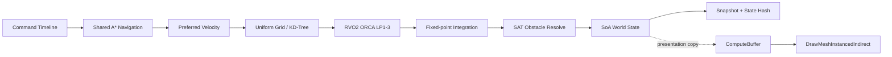

# 架构与数据流

## 设计目标

该项目把“权威仿真”和“Unity 表现”分成两个世界：前者只接受整数/定点数数据并以固定 30 Hz 推进，后者可以自由使用 `float`、相机、IMGUI 和 GPU API。这样既便于帧同步/回滚验证，也让渲染帧率不会改变游戏结果。

## 每个逻辑 tick 的系统顺序



系统顺序固定。ORCA 为每个实体只写自己的 `NextVelocities[i]`；移动积分在全部避障任务结束后统一读取，因此并行执行不会形成“先更新的单位影响后更新单位”的次序依赖。

## SoA World

`SwarmWorld` 不为 Agent 创建对象，而是维护固定容量的组件列：

```text
Positions[]           FPVector2
Velocities[]          FPVector2
PreferredVelocities[] FPVector2
NextVelocities[]      FPVector2
FormationOffsets[]    FPVector2
Radii[]               FP
MaxSpeeds[]           FP
Groups[]              byte
PathCursors[]         ushort
```

实体 ID 是 `Index + Generation`。系统以顺序索引扫描连续数组，避免对象图、虚调用和每帧枚举器。所有热路径容量在初始化时确定，运行中不 resize。

这是一套为了展示底层原理而手写的 ECS，不是 Unity Entities/DOTS。它实现了本 Demo 需要的稳定实体、SoA 组件列和系统调度，没有伪装成完整 archetype/chunk 框架。

## 空间查询

### Uniform Grid（默认）

- Build 时把实体插入固定容量开放寻址哈希表。
- 每个 cell 的链表以实体 ID 升序稳定构造。
- Radius Query 扫描相交 cell，并在扫描期维护最多 `K` 个有序候选。
- 排序键为 `(distanceSquared, entityId)`，同距时不依赖哈希桶遍历顺序。
- 并行 ORCA 的每条 lane 拥有自己的 9 项查询 scratch（8 邻居 + self），查询过程零共享写入。

### KD-Tree（对照实现）

`DataOrientedKdTree2D` 使用数组节点、确定性中位划分、半径和 KNN 查询。运行中按 `K` 可切换，用于对比均匀密集分布与非均匀分布下的索引行为。KD-Tree 路径当前保持单线程，避免为了 Demo 隐藏额外同步成本。

## A* 与群组路径

宏观导航使用 64×64 `GridMap`：静态 OBB 栅格化为不可走区域，周边代价通过整数核模糊，使路线远离障碍边缘。四个群组各保存一条 `SharedPath`，10,000 个 Agent 仅维护轻量 `PathCursor` 与 formation offset；地图 revision 或目标改变时才重新规划。

这不是“每个单位一条 A*”，因为大规模单位在同目标场景中共享宏观走廊更符合工业化成本模型。个体差异交给局部 ORCA 和编队偏移处理。

## ORCA 并行模型

- 主线程和最多 15 条后台线程组成持久 worker pool。
- 世界按实体索引划分为固定连续区间，线程数只改变执行速度，不改变单实体输入、邻居排序或写入位置。
- 每条 lane 有独立的 neighbor、ORCA line、projection line 和 query scratch。
- 不使用 `Task`、`Parallel.For`、闭包或每 tick 委托。
- 同一输入下，单线程/并行路径产出相同 raw fixed-point 状态。

## SAT 与渲染边界

碰撞阶段使用定点数圆/OBB 和 OBB/OBB SAT。当前位置被静态障碍推出最小穿透轴，并消除朝向障碍的速度分量。项目没有调用 Unity Physics。

渲染器在 `LateUpdate` 将 Q16.16 位置转换成表现层 `float`，上传到结构化 GPU buffer。Mesh、材质、args buffer 与实例数据 buffer 都复用；10,000 个 Agent 使用一次 `DrawMeshInstancedIndirect`。地面、障碍和 HUD 是独立表现 draw，不属于 Agent batch。

## 内存与 GC 策略

- ECS 组件列、空间索引、A* open/closed 数据、ORCA scratch、快照环和命令时间线全部预分配。
- 热循环不使用 LINQ、装箱、字符串或容器扩容。
- HUD 字符串与 GPU 上传属于表现层，不计入 headless simulation benchmark。
- 64 帧、10,000 Agent 的 rollback ring 保存位置、速度、路径游标与群组目标，约十余 MB，换取常数时间 slot 定位和无运行时分配。
