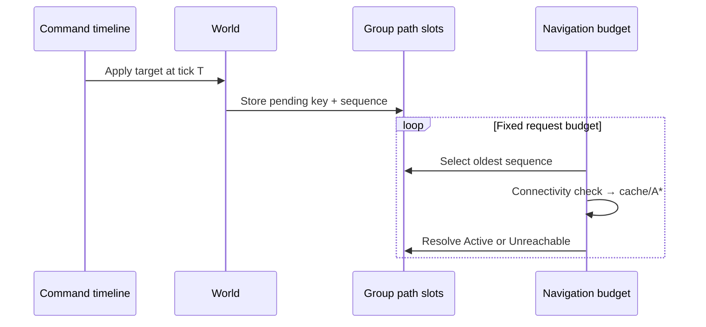
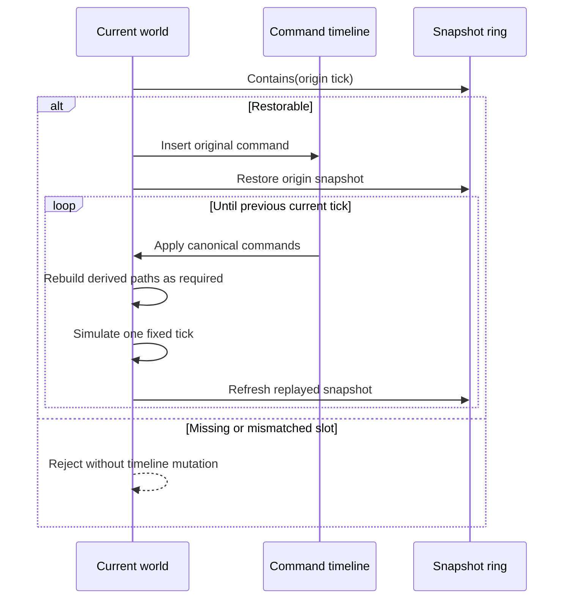

# Determinism, rollback and replay

## 1. Deterministic contract

For the same logic version, configuration, initial seed and canonical command stream, the simulation is designed to produce identical raw authoritative state.

The contract is based on:

1. **Fixed numeric rules**: signed Q16.16, saturating overflow, truncating multiplication/division, integer square root and integer-only formation sizing.
2. **Fixed time step**: the authority layer uses the Q16.16 representation of `1/30` and never reads `Time.deltaTime`.
3. **Stable traversal and tie-breaks**: entity index, obstacle ID, A* `f → h → nodeId`, request sequence and distance/ID ordering are explicit.
4. **Canonical commands**: fixed-capacity storage orders commands by `(tick, sequence)`.
5. **Race-free parallelism**: avoidance reads tick-start state, writes disjoint output slots and completes before integration.
6. **No Unity authority types**: `Core` and `Simulation` do not use Unity Physics, NavMesh, `UnityEngine.Random` or Unity vectors.
7. **Fixed hot-path capacity**: component, query, path, ORCA, command and snapshot storage are reserved during setup.

These rules reduce platform divergence; they do not by themselves prove bit identity on every runtime or CPU. Cross-backend claims require replay artifacts and results from each named target.

## 2. Configuration identity

`SwarmConfig.ConfigHash` covers all values that can change simulation results, including fixed delta, radius, speed, acceleration, turn step, neighbor distance/count, time horizon, world extent and spatial mode. A replay/config handshake must reject an incompatible value instead of executing under local defaults.

Static obstacle topology is immutable setup data. The current rollback snapshot does not carry obstacle geometry or BVH nodes. Changing topology requires rebuilding the simulation and starting a new history epoch.

## 3. Authority schema and layered hashes

The diagnostic schema hashes fixed domains independently and also produces a complete schema-ordered value:

| Domain | Fields |
|---|---|
| Config | `ConfigHash` |
| World metadata | tick, agent count, seed, `SpatialIndexMode` |
| Group targets | four fixed-point targets |
| Group path states | resolved/pending key, revision, status and pending sequence |
| Navigation sequence | `NextPathRequestSequence` |
| Agent positions | X/Y raw by stable entity index |
| Agent velocities | X/Y raw by stable entity index |
| Agent path cursors | cursor by stable entity index |

The full hash is a fast regression and checkpoint signal, not a cryptographic signature.

When two worlds differ, the desync scan follows the same stable schema order and reports:

```text
component + entity/group index + field + expected raw + actual raw
```

This separates two questions:

- Which tick first diverged? Compare replay checkpoint hashes.
- Which scalar first differs? Compare authority layers and then scan the failing component.

A legitimate schema or logic change may change every later checkpoint. The replay schema, logic identity and source commit must therefore travel with the hash sequence.

## 4. Snapshot schema

`WorldSnapshotRing` preallocates a bounded number of slots containing:

- tick and agent count;
- position and velocity columns;
- path cursors;
- group targets;
- four `GroupPathState` values;
- `NextPathRequestSequence`;
- `SpatialIndexMode`.

Seed, group, radius, max speed, formation offset, config, navigation topology and static obstacles are immutable within an epoch and are not copied into each slot.

### Derived paths

Shared path node/waypoint arrays and `SharedPathCache` are derived storage. Their authoritative key is:

```text
resolvedStartIndex + resolvedGoalIndex + resolvedMapRevision
```

After restore, `PrepareDerivedPaths()` keeps a matching path, copies a cached path, or runs deterministic A* synchronously. Cache layout and hit rate may change recovery cost but must not change the resulting path or authority state. A derived rebuild does not consume the per-tick path-request budget.

## 5. Budgeted navigation under rollback

A target command writes or replaces the pending slot for its group. The navigation System then consumes at most the configured budget in pending-sequence order:



Resolved and pending fields plus the global request sequence are snapshotted and hashed. Restoring tick T therefore restores the same backlog and consumption order.

## 6. Late command transaction

`InjectLateCommand()` receives the authority-provided command including its original `(tick, sequence)`. Before modifying the timeline it verifies that the origin snapshot still exists for the current agent count.



After saving tick T, the controller removes only commands older than the earliest restorable tick and reuses fixed storage. Missing history is an explicit failure; a network implementation should request an authoritative full snapshot rather than silently clamp the origin tick.

The current command/navigation sequence is a signed 32-bit value. Long-running transport protocol work must define an epoch or tested serial-number comparison before crossing wraparound; the replay format does not turn ordinary signed ordering into a safe long-lived network sequence.

## 7. Versioned replay

`.swarmreplay` is an explicit little-endian binary envelope for reproducible simulation input. Its versioned data includes format identity, schema/logic/config identity, initialization parameters, canonical commands and checkpoint hashes. Reading validates bounds, enum/config compatibility and payload integrity before constructing runtime data.

A replay runner executes without rendering and emits checkpoint results suitable for comparison across independent processes. The file is not a snapshot replacement: commands before the initial state, static topology and logic/config identity must still agree.

The repository entry point is:

```bash
./Scripts/run-cross-process-replay.sh
```

It launches `SwarmReplayProcessRunner.CaptureFromCommandLine` and `VerifyFromCommandLine` in two separate Unity batchmode processes. The tracked evidence set is:

```text
ReplayResults/cross-process.swarmreplay
ReplayResults/capture.json
ReplayResults/verify.json
ReplayResults/latest.md
```

The capture uses a fixed workload and records replay SHA-256, schema/logic/config identity and final layered hashes. Verification requires a different process ID, deserializes and validates the same bytes, recomputes every checkpoint, and records a deliberate `AgentPositions[0].X.Raw` one-raw-unit mutation as the desync probe. Capture and verify JSON/Markdown are the public evidence; raw Unity logs remain local unless a privacy-scrubbed excerpt is required.

Recommended cross-process procedure:

1. Run `Scripts/run-cross-process-replay.sh` from a frozen commit and record the replay SHA-256.
2. Confirm capture/verify process IDs differ and execute that exact file on the same backend.
3. Compare every checkpoint, not only the final value.
4. Repeat on each runtime/architecture that will be named in the compatibility matrix.
5. On a mismatch, identify the first checkpoint and run the layered field diff on the corresponding restored states.

## 8. Catch-up

`QueueCatchUp(600)` models a logic backlog. The Host advances a bounded number of ticks per presentation frame and suppresses intermediate GPU upload/draw until caught up. This verifies simulation/presentation separation, not network download, full-snapshot deserialization or confirmed-tick protocol behavior.

## 9. Evidence levels

Evidence should be recorded at increasing strength:

1. two Worlds in one process, same seed and command stream;
2. on-time command versus late command plus rollback;
3. serialized replay executed by two independent processes on one backend;
4. the same replay across Mono/IL2CPP and ARM64/x64 targets;
5. long-running lane-count and weak-network matrices.

Only completed levels with raw artifacts bound to a source commit should be reported. A matching final hash alone cannot show where an earlier transient divergence occurred, which is why checkpoint streams and field-level diagnostics are retained.

## 10. Current network boundary

The repository contains a deterministic command timeline, bounded rollback, catch-up, versioned replay and diagnostics. It does not yet include:

- UDP/KCP transport, acknowledgements, retransmission or clock synchronization;
- authoritative server arbitration and input confirmation;
- out-of-window full/delta snapshot transfer, fragmentation or repair;
- disconnect/reconnect session state;
- dynamic map topology serialization;
- a completed Mono/IL2CPP and ARM64/x64 evidence matrix.

The ordered next steps and acceptance gates are defined in [`ROADMAP_2027.md`](ROADMAP_2027.md).
