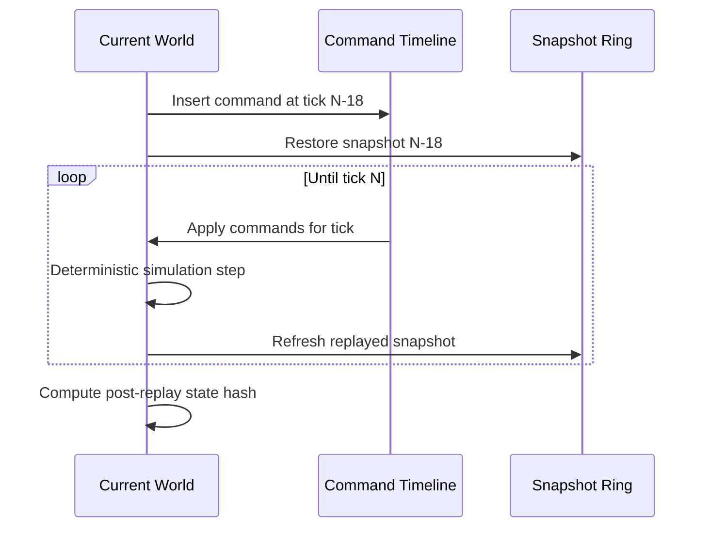

# 确定性、Rollback 与追帧

## 确定性契约

该 Demo 的目标不是“看起来差不多”，而是同一初始状态与命令序列产生 raw bit 完全相同的权威状态。

1. **数值规则固定**：`FP` 为有符号 Q16.16；加减乘除溢出饱和，乘除向零截断，平方根使用整数算法。
2. **固定时间步**：仿真只使用 `1/30` 的定点数 delta，不读取 `Time.deltaTime`。
3. **稳定遍历**：实体按稳定 ID 扫描；邻居按 `(distance², entityId)` 排序；A* 的 heap/邻接访问有固定 tie-break。
4. **无 Unity 权威类型**：`Core` / `Simulation` assembly 不引用 `UnityEngine.Vector*`、Physics 或随机数。
5. **并行无次序依赖**：ORCA 读取上一 tick 的 position/velocity，仅写自己的 next velocity，barrier 后再统一积分。
6. **预分配**：热路径没有 GC 引发的不可控停顿，也不会因容器扩容改变遍历布局。

`float` 只出现在表现层相机、HUD 和 GPU 上传边界；这些值不会写回权威世界。

## 完整状态哈希

`SwarmWorld.ComputeStateHash()` 以稳定小端字节顺序混合以下权威字段：

- Tick、Agent Count、Seed
- 四个群组目标
- 每个 Agent 的 position raw X/Y
- 每个 Agent 的 velocity raw X/Y
- 每个 Agent 的 path cursor

HUD 每 16 tick 显示一次哈希。测试创建两个同 seed 世界并推进相同 tick，要求最终哈希相同；基准也提交最终哈希，使性能优化同时具备行为回归证据。

## Rollback 流程

`RollbackController` 维护：

- 64 帧 `WorldSnapshotRing`
- 固定容量 `CommandTimeline`
- 单调 command sequence，解决同 tick 指令顺序

注入一条来自过去的权威群组目标时：

EditMode 测试分别跑“指令准时到达”和“延迟到达后回滚”，要求最终 tick、position、velocity、target、cursor 与状态哈希一致。

## 追帧

`QueueCatchUp(600)` 模拟断线重连后的逻辑积压。Host 每个渲染帧最多执行配置数量的逻辑 tick；backlog 非零时跳过 `LateUpdate` 的 GPU upload/draw，直到追上实时 tick。这样把 CPU 时间给确定性 System，而不是重复渲染无意义的中间状态。

## 已知边界

- 当前“网络”是确定性命令与延迟注入实验室，不含 UDP/KCP、真实服务器、丢包重传、时钟同步或反作弊。
- 快照采用完整拷贝，设计重点是清晰与 O(1) slot；商业项目可继续做 delta snapshot、压缩与分层状态。
- 历史窗口为 64 tick，超过窗口的权威修正需要全量快照同步。
- 固定点消除了 CPU 浮点差异，但仍需锁定算法版本、配置、指令序列与资源数据才能形成完整帧同步协议。

这些限制是下一阶段真实网络对战的扩展点，而不是本仓库已经完成的能力。
