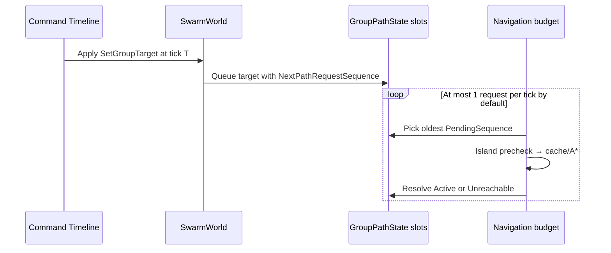
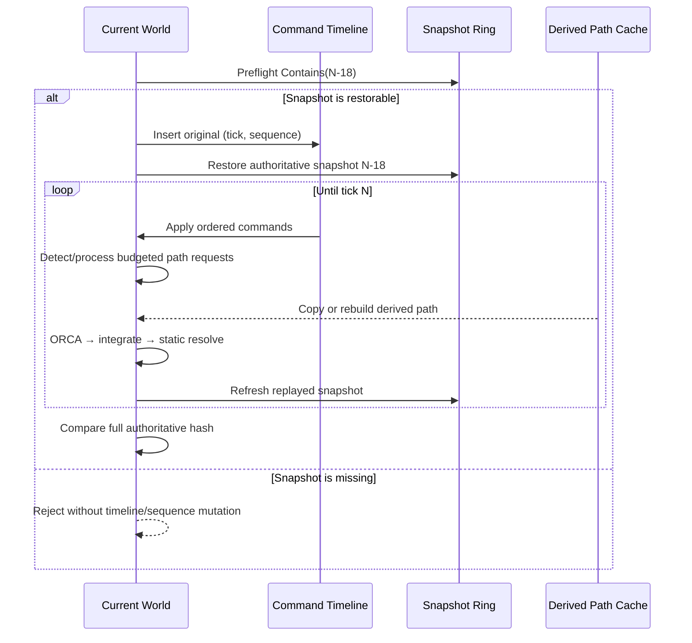

# 确定性、Rollback 与追帧

## 1. 确定性契约

目标是：相同 logic version、config、初始 seed 和命令流，产生 raw bit 完全相同的权威状态。

1. **固定数值规则**：`FP` 是有符号 Q16.16；溢出饱和，乘除向零截断，平方根使用整数算法。
2. **固定时间步**：仿真只使用定点数 `1/30`，不读取 `Time.deltaTime`。
3. **稳定遍历与 tie-break**：Entity 按稳定 index 扫描；KD radius 使用 `ulong` raw-square，KNN 使用覆盖完整二维 Q16.16 域的 65-bit squared distance，空间结果按 `(distance², entityId)`；A* 按 `f → h → nodeId`；路径请求按 sequence；编队 anchor 由全部成员逻辑中心与稳定最近 cell 决定。
4. **命令规范顺序**：`CommandTimeline` 固定容量，按 `(tick, sequence)` 插入；同 key 更新原命令。
5. **并行无写冲突**：ORCA 读取旧 position/velocity，只写各自 `NextVelocities[i]`，barrier 后统一积分。
6. **权威层无 Unity 类型**：`Core` / `Simulation` 不使用 Unity Physics、NavMesh、`Random` 或 `Vector*`。
7. **无热路径容量变化**：组件、索引、A*、island、cache、ORCA 和 snapshot storage 预分配。

`float` 只存在于相机、HUD 与 GPU 上传边界，不会写回 `SwarmWorld`。

这套规则降低跨平台分歧风险，但仓库当前验证的是同机/同版本确定性；Mono/IL2CPP、ARM64/x64 的正式矩阵仍属于下一阶段，不能提前宣称“全平台已证明一致”。

## 2. 权威状态哈希

`SwarmWorld.ComputeStateHash()` 以固定字段顺序混合：

- Tick、Agent Count、Seed、`SpatialIndexMode`；
- 4 个 GroupTarget；
- 每组 `GroupPathState`：resolved start/goal/map revision/status 与 pending start/goal/map revision/sequence；
- `NextPathRequestSequence`；
- 每 Agent 的 position raw X/Y、velocity raw X/Y、path cursor。

新增 `GroupPathState`、request sequence 和 `SpatialIndexMode` 很重要：即使两端当前画面位置相同，只要它们下一 tick 将处理不同的 A* 请求或邻域算法，就已经是权威状态分歧。

当前 hash 是快速回归/定位信号，不是密码学签名。最新 10k Uniform Grid benchmark 的 full hash 为 `0x4BD5680667C14261`；算法或 schema 合法变化会改变该值，应与代码版本一起记录。

跨空间模式比较时不能直接要求 full hash 相同，因为它包含权威字段 `SpatialIndexMode`。Benchmark 额外记录 canonical spatial comparison hash：计算期间只把该模式字段暂时归一化为 `UniformGrid`，其余权威字段不变，随后恢复原模式。本次相同 seed/config 的 Grid radius 与 KD radius canonical hash 都是 `0x4BD5680667C14261`，证明这次终态权威结果等价；KD exact KNN 此次也相同，但因为选邻语义不同，这只是当前场景的观察，不能泛化为任意输入都等价。该 canonical hash 同样不替代跨进程、跨后端和跨 CPU 证明。

## 3. Snapshot schema

`WorldSnapshotRing` 为 64 个 slot 预分配以下动态状态：

- tick、count；
- position / velocity；
- path cursor；
- group target；
- 4 个 `GroupPathState`；
- `NextPathRequestSequence`；
- `SpatialIndexMode`。

Seed、group、radius、max speed、formation offset 和 map/config 在当前运行中不可变，由初始化版本保证一致，因此不在每帧重复复制。若未来允许运行时修改这些数据，必须同时升级 snapshot/hash schema。

### 查询模式的权威命令与重放

Avoidance 每 tick 从 `SwarmWorld.SpatialIndexMode` 读取 Grid radius、KD radius 或 KD exact KNN。该模式会影响未来速度，因此同时进入 hash 与 `WorldSnapshotRing`。

运行时 `K` 键通过 `RollbackController.QueueSpatialIndexMode()` 创建 `SimulationCommandType.SetSpatialIndexMode`，以当前 world tick 和稳定 sequence 排入同一条 `CommandTimeline`。命令在下一次 logic step 的 command phase 生效；如果后续 rollback 回到切换之前，replay 会在原 tick 按原顺序再次应用 mode 命令，现有 history 与 command stream 都保持连续。

### 为什么不快照 waypoint 数组？

`SharedPath.NodeIndices[]` / `Waypoints[]` 与 `SharedPathCache` 是**派生缓存**，可由以下 key 唯一重建：

```text
resolvedStartIndex + resolvedGoalIndex + resolvedMapRevision
```

Rollback 恢复权威 key 后，`PrepareDerivedPaths()` 会：

1. 检查现有 group path 是否与 key 匹配；
2. 否则尝试从固定容量 cache 复制；
3. cache miss 时以相同 map 与 tie-break 同步重跑 A*。

因此 cache 的 hit/miss、entry 布局和 replacement cursor 可以改变恢复成本，但不允许改变最终路径或状态。默认 68 项覆盖默认 64 tick window 的常见恢复集合；极端淘汰时的同步 `DerivedAStarRebuilds` 不消耗权威 `MaxPathRequestsPerTick`，因为它没有创建新请求，只是在当前 tick 物化已经恢复的 resolved state。相关测试验证该路径 0 B、`LastProcessedPathRequests == 0`，并覆盖预算 backlog 的 on-time / rollback 最终 hash 一致。

## 4. 预算化路径请求如何参与 Rollback

动态目标到达时，导航 System 不直接无上限地跑 A*，而是写入每组 pending state：



因为 resolved/pending 状态和全局请求序号都进入 snapshot/hash，回滚到 T 后会恢复同一 backlog，并以同一顺序消耗固定预算。默认预算为 1 request/tick；修改预算属于 logic/config change，必须参与版本握手或配置哈希。

## 5. Rollback 流程

`RollbackController` 保存 64 tick history 和固定容量 command timeline。每次保存当前 tick 快照后，它按最老可恢复 tick 确定性丢弃更早的有序命令前缀，保留项原地前移并复用固定数组；因此容量服务于 rollback window，而不是随进程生命周期无限累计。网络层必须把服务器给出的完整 `SimulationCommand` 传给 `InjectLateCommand()`；其原始 `(tick, sequence)` 会原样进入 timeline，不能在包抵达时按本地到达顺序重新编号。注入一条来自过去的权威指令时：

当前导航请求与本地演示命令的 sequence 是 32-bit 有符号整数，到 `int.MaxValue` 后归零；排序尚未采用模序比较。它是短时实验室的明确寿命边界，v0.3 replay/protocol schema 会引入 sequence epoch 或经过回绕回归的 serial-number arithmetic，不能直接把现实现状用于长期在线服务器。



`WorldSnapshotRing.Contains()` 同时检查环槽 tick 与当前 agent count。只有 origin snapshot 可恢复时，late command 才会进入 timeline；history reset、slot 已被覆盖或 agent count 不匹配时直接拒绝，避免留下无法成功回滚却会在未来 replay 中出现的脏命令，也不会推进本地演示 sequence。`InjectLocallyGeneratedLateGroupTarget()` 仅供 Host 按键演示，它会在本地生成命令并把过大的 latency 参数钳制到窗口内；真实网络不得调用这个便捷入口，超窗时应请求权威 full snapshot。

600 条连续命令回归使用 8 tick history 与 16 项 command capacity，在两个 World 上持续触发过期前缀回收；所有命令均被接受，timeline 始终受窗口约束，最终 group target 与 hash 一致。回收边界保留仍可参与最深 rollback 的 tick，不会提前删除可重放命令。

### 地图 topology epoch 边界

`GroupPathState` 中的 map revision 会进入 snapshot/hash，但 Grid 的 blocked-cell topology 本身仍是外部静态数据，没有复制到每帧 snapshot。地图拓扑/revision 切换后必须调用 `ResetHistory()`，从双方都已安装相同 topology 的 tick 开启新的 rollback epoch；当前不能跨 topology epoch 恢复旧快照。现有 map revision 回归是在新 revision 生效并重置 history 后，验证该 epoch 内的 on-time 与 late replay 收敛。

## 6. Catch-up

`QueueCatchUp(600)` 模拟重连后的逻辑积压。Host 每个表现帧执行有限数量的 logic tick；backlog 非零时跳过 `LateUpdate` 的 GPU upload/draw，直到追上实时状态。它验证“仿真与表现解耦”的执行链，但没有实现网络下载、snapshot deserialize 或 confirmed tick 协议。

## 7. 当前证据

- 2026-07-14 v0.2.1 完整 Unity EditMode：**77 / 77 Passed，0 failed/skipped**（0.9254662 秒）；公开证据以对应 Release XML 为准。
- 双 World 同 seed / 同命令保持相同 hash。
- 指令准时到达与延迟到达后 rollback 的最终状态一致；同 tick、同 Group 的 sequence 0/1 即使按 1/0 乱序抵达，replay 后仍以原 sequence 得到相同 target/hash。
- 多组动态目标形成 path backlog 时，默认每 tick 只处理 1 个，并在 rollback 后得到相同 `GroupPathState` / hash。
- `SpatialIndexMode` 改变 hash、随 snapshot restore，并作为权威命令在 rollback 跨越切换 tick 时按原序重新应用。
- 缺少可恢复 origin snapshot 的 late command 会在写入 timeline 前被拒绝，command count 与本地生成 sequence 都保持不变。
- 10k replan 测试验证 logical squad center 不会重复叠加 formation offset。
- KD 测试验证 radius 的原始距离语义一致，以及 exact KNN 的无分配 65-bit squared distance 在完整二维 Q16.16 坐标域内仍保持正确排序和 split-plane 剪枝。
- 600 条连续命令测试验证 timeline 会按 rollback window 确定性回收过期前缀，固定容量不会随累计历史耗尽，双 World 最终 hash 一致。
- GridIslandMap、cached/uncached request A*、极端 derived replay A*、KNN 与 simulation hot path 均有 warmup 后零 managed allocation 测试。
- 最新 10k、8 warmup + 32 sample headless benchmark：19.919240625 ms average、24.5924 ms P95、17.0747/26.0361 ms min/max、current-thread 0 B；运行配置为 Uniform Grid caller + 14 workers、1 request/tick、68-entry path cache、1 个 navigation island、248 个 shared waypoints，full/canonical hash 均为 `0x4BD5680667C14261`。
- 同 seed/config 的完整模式矩阵：Uniform Grid 18.73074375/21.2342 ms、KD radius 114.1174875/125.944 ms、KD exact KNN 98.874775/108.3109 ms（average/P95）；三者 min/max 分别为 16.8525/22.6702、104.8276/127.9858、90.9214/109.7333 ms，current-thread 均为 0 B。KD 模式当前由 caller thread 执行 avoidance，Uniform Grid 使用 caller + 14 workers，因此这是端到端运行模式对照，不能把差值全部归因于 KD 查询本身。
- 三模式 full hash 分别为 `0x4BD5680667C14261`、`0xE8AE71279C8EC54C`、`0x008726C93F9563E3`；canonical hash 均为 `0x4BD5680667C14261`，含义与外推边界见第 2 节。

## 8. 尚未实现

- 真实 UDP/KCP transport、服务器仲裁、input confirmation、ack/retransmit 与时钟同步；
- 跨进程 replay file、logic/config handshake 与 component-level desync diff；
- 超过 64 tick 的 full snapshot recovery、delta snapshot、压缩和分片；
- Mono/IL2CPP、ARM64/x64、Metal/DX12 的确定性平台矩阵；
- 动态 map 数据的 snapshot/versioning。当前 island map 支持 revision 重建，但运行时障碍布局仍是静态的。

这些是 [`ROADMAP_2027.md`](ROADMAP_2027.md) 的量化下一阶段，不是本仓库已经完成的网络能力。
