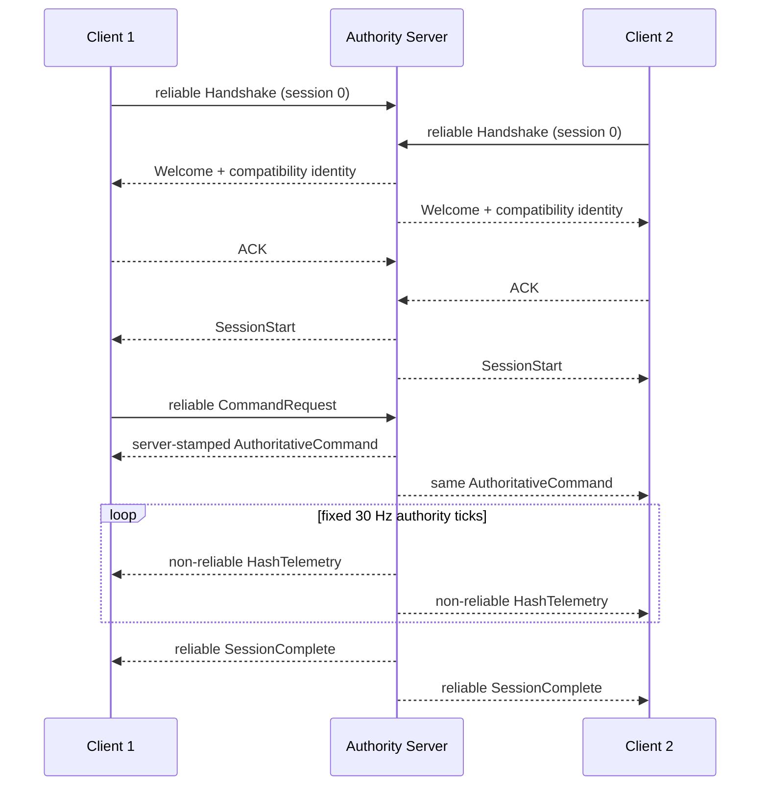
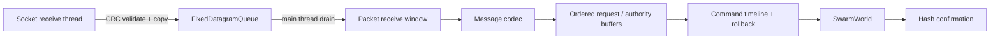

# Swarm UDP protocol v0.4

## 1. Scope

Protocol v0.4 carries deterministic simulation commands and authority hash telemetry between one session server and two clients over IPv4 UDP. The reference runner targets loopback/LAN validation. Account identity, encryption, authentication, NAT traversal, matchmaking, anti-cheat, reconnect and snapshot transfer are outside this version.

The server is peer `0`; clients are peers `1` and `2`. A network receive thread may validate and copy a packet, but only Unity's main simulation thread may interpret messages, mutate the command timeline, step `SwarmWorld` or perform rollback.

## 2. Datagram envelope

All integer fields are explicit little-endian. A datagram is limited to 1,200 bytes: a 44-byte header plus at most 1,156 payload bytes.

| Offset | Bytes | Field | Rule |
|---:|---:|---|---|
| 0 | 4 | Magic | `SWRM` (`0x4D525753` when decoded little-endian) |
| 4 | 2 | Protocol version | `1` |
| 6 | 2 | Header bytes | `44` |
| 8 | 4 | Session ID | `0` during handshake; assigned value afterwards |
| 12 | 4 | Peer ID | Sender identity |
| 16 | 4 | Packet sequence | Unsigned serial number, shared by all channels in one direction |
| 20 | 4 | ACK | Newest packet sequence accepted from the remote peer |
| 24 | 4 | ACK bits | Receipt bitmap for the previous 32 packet sequences |
| 28 | 4 | Logic tick | Sender's current simulation tick |
| 32 | 1 | Channel | Control, reliable command or hash telemetry |
| 33 | 1 | Flags | Reliable and/or ACK-only |
| 34 | 2 | Payload bytes | Exact payload length |
| 36 | 4 | Payload CRC32 | Zero for an empty payload |
| 40 | 4 | Header CRC32 | CRC of bytes `[0, 40)` |

The decoder rejects an unknown magic/version/header size, unknown channel/flag, invalid length, non-empty ACK-only payload, header CRC mismatch or payload CRC mismatch before message decoding.

CRC detects accidental corruption; it is not a message authentication code.

## 3. Sequencing and reliability

Packet sequences use RFC-1982-style unsigned half-range comparison. Exactly half-range-separated values are intentionally unordered. The receive window accepts new and out-of-order packets within the 32-packet bitmap, rejects duplicates/stale packets and emits `ack + ackBits` on later packets.

Reliable messages retain the complete encoded datagram in a fixed-capacity per-peer window. Retransmission repeats the same packet sequence and bytes after the retry interval. A duplicate reliable packet marks the ACK state dirty again, allowing recovery when the previous ACK-only packet was lost. RTT values are measured from first send to acknowledgement.

Packet reliability does not define application command order. `AuthoritativeCommand` carries a server sequence, and each client releases commands to reconciliation only when every earlier authority sequence is available. Each server-side client request buffer similarly consumes `RequestId` in unsigned serial order. Both buffers have fixed windows and fail explicitly on overflow.

Hash telemetry is non-reliable. A lost sample is not retransmitted; every sample that does arrive must match the client's replay-corrected local hash for that tick.

## 4. Channels and messages

| Channel | Message | Delivery |
|---|---|---|
| Control | `Handshake`, `Welcome`, `Reject`, `SessionStart`, `SessionComplete`, `SnapshotRequired` | Reliable except ACK-only envelope |
| Reliable command | `CommandRequest`, `AuthoritativeCommand` | Reliable plus application ordering |
| Hash telemetry | `HashTelemetry` | Non-reliable |

Every message begins with a one-byte type and has a fixed encoded size in v0.4. The codec validates exact size, enum ranges, group IDs and spatial-mode values.

### Compatibility identity

The handshake compares all of the following before the session starts:

- packet protocol version;
- simulation logic hash;
- `ConfigHash` and configuration schema;
- replay schema;
- snapshot schema;
- authority-diagnostic schema;
- Q16.16 fractional-bit count;
- Agent count and deterministic formation seed.

Mixed identities are rejected rather than executed under local defaults.

## 5. Session state machines



The server assigns every accepted request a canonical command tick and monotonically increasing authority sequence, queues the command into its own rollback controller, then broadcasts the unchanged command to both clients.

Clients predict to a bounded lead over their local session clock. A future authority command enters the normal command timeline. A past command restores its original tick, inserts the unchanged server sequence and re-simulates to the previous predicted tick. The hash observer rewrites the affected local tick samples during replay.

If the origin snapshot no longer exists, the client enters `SnapshotRequired`, sends the failed command/current/earliest-restorable ticks and stops prediction. v0.4 deliberately does not clamp the command tick or fabricate state repair.

## 6. Thread and capacity boundary



The receive queue, reliable windows, weak-network scheduler, request buffers, authority buffer, command timeline, hash ring and rollback snapshots are fixed-capacity. Reports expose queue/capacity drops. The qualification script requires them to remain zero.

## 7. Weak-network qualification

`DeterministicWeakNetwork` schedules outgoing encoded datagrams before the real socket send. A seeded integer PRNG chooses latency jitter, loss, duplication and reorder delay; scheduled entries use stable due-time/insertion ordering. The seed makes impairment decisions reproducible for a given call order, while operating-system process scheduling may still change when requests reach the authority and therefore which server tick is assigned.

Run the default qualification after building the Player:

```bash
./Scripts/run-authoritative-udp-session.sh
```

The script launches three distinct Player processes, validates every JSON report and writes `NetworkResults/latest/`. It requires:

- one server and clients `1`/`2` with a shared compatibility identity;
- the complete four-command authority stream on both clients;
- at least one late-command rollback per client;
- confirmation of every received server hash sample;
- identical final authority state hashes;
- exercised loss, reorder and reliable retransmission;
- zero socket errors, rejected datagrams, bounded-queue drops and pending reliable packets.

For a 30-minute real-time soak, use 54,000 logic ticks:

```bash
SWARM_NETWORK_FINAL_TICK=54000 ./Scripts/run-authoritative-udp-session.sh
```

Tracked short-run evidence is a release qualification artifact, not a claim that the long soak ran on every platform.

## 8. Security and production boundaries

- Peer IDs and endpoints are session-routing values, not authenticated identities.
- The server trusts a compatible loopback/LAN client to submit bounded command requests.
- CRC does not protect against deliberate modification or replay attacks.
- There is no congestion control, path MTU discovery, fragmentation, key rotation or denial-of-service protection.
- Input delay and prediction lead are fixed session parameters; v0.4 does not implement a production clock-discipline algorithm.
- Full/delta snapshots, reconnect and catch-up state repair are v0.5 scope.
