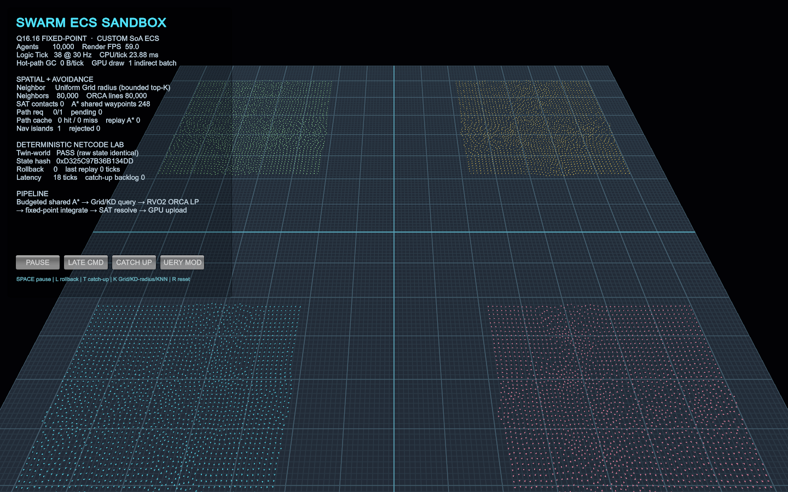

# Swarm-ECS-Sandbox

> 10,000 Agent · Q16.16 Fixed-Point · Custom SoA ECS · Budgeted Dynamic A* · Uniform Grid / KD-Tree · RVO2 ORCA · Rollback · Indirect Rendering

这是一个面向客户端底层、确定性仿真与网络同步岗位的 Unity 技术作品集。项目不使用 Unity Physics、NavMesh 或“每个单位一个 GameObject”：10,000 个 Agent 的权威逻辑运行在纯 C#、固定容量、固定时间步的仿真中，Unity 只承担输入、调试 UI 与表现渲染。当前“确定性”证据覆盖同一代码与运行环境中的双 World、命令重放和 rollback；跨进程、Mono/IL2CPP 与 ARM64/x64 一致性仍是下一阶段。



## 发布与证据状态

- 当前公开版本为 `v0.2.1 Navigation Completeness`；只有绑定具体 commit 的 Git tag、GitHub Release 和附件才作为公开证据，分支或工作树中的内容不计入发布能力。
- `BenchmarkResults/latest.json` / `latest.md` 与 `spatial-index-matrix.json` / `.md` 是仓库跟踪的短时 headless 结果。2026-07-14 在 v0.2.1 源码上本地运行完整 EditMode：**77 / 77 Passed，0 failed/skipped**（0.9254662 秒）；原始 `TestResults/editmode.xml` 作为 Release 附件公开。
- 默认 GitHub Actions 只做无需 Unity License 的静态校验并归档仓库内 benchmark；可选 GameCI job 只有显式配置后才运行 Unity 测试。绿色静态检查不能被描述成“远端 Unity EditMode 已通过”。
- 发布前检查与证据清单见 [`Docs/RELEASE_CHECKLIST.md`](Docs/RELEASE_CHECKLIST.md)，版本变化见 [`CHANGELOG.md`](CHANGELOG.md)。

## 已实现

- **Q16.16 定点数核心**：饱和加减乘除、整数平方根、向量、确定性 PRNG 与 FNV-1a 状态哈希；`Core` / `Simulation` 不引用 `UnityEngine`。
- **自定义 SoA ECS**：Position、Velocity、Radius、Group、PathCursor 等按组件列连续存储；实体使用稳定的 `index + generation`，运行容量预分配。
- **预算化动态 A***：64×64 八邻接网格支持动态群组目标；4 个群组各有一个固定请求状态槽，同组新目标会合并未处理目标，跨群组按稳定序号选择，默认每个 logic tick 最多处理 **1 个**。它不是任意容量的通用请求队列。Replan anchor 是群组内 `Position - FormationOffset` 的定点数平均中心，必要时以稳定 node id tie-break 选择最近可走 cell，避免把 formation offset 叠加两次。
- **连通岛预检**：`GridIslandMap` 使用与 A* 相同的斜角规则标记连通分量，在进入 A* 前拒绝 blocked 或跨岛请求；地图 revision 变化时以预分配数组重建。
- **固定容量路径缓存**：`SharedPathCache` 默认 68 项（4 个群组 + 默认 64 tick rollback window），以 `(start, goal, mapRevision)` 为 key、确定性 round-robin 替换；10,000 个 Agent 共享 4 条宏观路线。极端 rollback cache miss 会同步重建派生 A*，不占权威 path-request budget。
- **三种邻域模式**：Uniform Grid radius + bounded top-K（默认并行）、KD-Tree radius、KD-Tree exact KNN；radius 查询使用精确 `ulong` raw-square，KNN 使用覆盖完整二维 Q16.16 坐标域、无分配的 65-bit squared distance，再按 `distance² + entityId` 排序，避免极端两轴距离溢出或饱和破坏 exact KNN。
- **Agent-Agent ORCA**：手写 RVO2-style half-plane 与 LP1/LP2/LP3，默认每 Agent 最多 8 邻居；持久 worker pool 按固定区间并行，无每 tick `Task` / LINQ / 临时容器。
- **定点数碰撞**：模块包含 OBB-vs-OBB SAT；运行时 Agent 使用 circle-vs-OBB 穿透修正处理 5 个静态障碍，不依赖 Unity Physics。
- **Rollback / Catch-up**：64 tick 快照环、按 `(tick, sequence)` 排序的命令时间线、延迟指令回滚重演，以及追帧期间跳过渲染。群组目标和 `SpatialIndexMode` 都通过权威命令在指定 tick 生效；late command 会先确认目标快照仍可恢复，再写入 timeline。时间线按最老可恢复 tick 确定性回收过期有序前缀，以固定容量存储持续复用。
- **可重建路径状态**：`GroupPathState`、pending request sequence、全局请求序号与 `SpatialIndexMode` 进入状态哈希和快照；大块 waypoint/node 数组是可从 key 重建的派生缓存，不复制进每帧快照。
- **Indirect Agent Rendering**：CPU 上传全部 Agent 的结构化数据，Unity 6 `Graphics.RenderMeshIndirect` 用一个 Agent indirect command 绘制；无逐 Agent GameObject。
- **商业化接入边界**：工程固定 YooAsset 3.0.4 与 HybridCLR 8.12.0，包含 asmdef、collector、AOT metadata / DLL 加载入口，但不把未执行的平台发布流程描述成生产级热更。
- **本地 EditMode 验证**：v0.2.1 完整 suite 为 **77 / 77 Passed，0 failed/skipped**，覆盖定点数、Grid/KD radius 原始距离等价性、完整 Q16.16 域 65-bit exact KNN、600 条命令的 timeline 回收、三种邻域模式快照/命令重放、late-command 原子拒绝、GridIslandMap、逻辑编队中心、预算调度/缓存、map revision、派生 A* 重建、SAT、ORCA、回滚与热路径零分配。原始 XML 的公开状态以对应 Release artifact 为准。

## 最新可复现基准

结果来自仓库内 [`BenchmarkResults/latest.json`](BenchmarkResults/latest.json)，使用 `-batchmode -nographics` 测量**纯逻辑 tick**。`Null Device` 表示没有测 GPU 渲染，因此这不是移动端或“60 FPS”结论。

| 项目 | 实测值 |
|---|---:|
| Unity / CPU | 6000.3.9f1 / Apple M5 Pro（15 logical cores） |
| Graphics Device | Null Device |
| Agent / Spatial Mode | 10,000 / Uniform Grid |
| 固定逻辑预算 | 30 Hz（33.333 ms/tick） |
| Warmup / Sample | 8 / 32 ticks |
| Avoidance execution | Caller + 14 background workers |
| Path budget / Cache | 1 request/tick / 68 entries |
| Navigation islands / Shared waypoints | 1 / 248 |
| Average | **19.919240625 ms/tick** |
| P95 | **24.5924 ms/tick** |
| Min / Max | 17.0747 / 26.0361 ms |
| Current-thread managed allocation | **0 B** |
| Final authoritative hash | `0x4BD5680667C14261` |
| Canonical spatial comparison hash | `0x4BD5680667C14261` |

这组数据只证明该硬件、Unity 版本与短采样配置下的逻辑性能。温控、后台负载和代码改动都会改变结果；它没有采集所有 worker 的 allocation，长稳 P99 与移动平台矩阵仍在路线图中。

同一 formation seed、fixed delta、neighbor distance、max neighbors 与 8/32 warmup/sample 下的三模式端到端对照位于 [`BenchmarkResults/spatial-index-matrix.json`](BenchmarkResults/spatial-index-matrix.json)：

| Spatial mode | Avoidance execution | Average | P95 | Min / Max | Current-thread GC | Full hash | Canonical hash |
|---|---|---:|---:|---:|---:|---|---|
| Uniform Grid radius | Caller + 14 workers | **18.73074375 ms** | **21.2342 ms** | 16.8525 / 22.6702 ms | 0 B | `0x4BD5680667C14261` | `0x4BD5680667C14261` |
| KD-Tree radius | Caller thread | 114.1174875 ms | 125.944 ms | 104.8276 / 127.9858 ms | 0 B | `0xE8AE71279C8EC54C` | `0x4BD5680667C14261` |
| KD-Tree exact KNN | Caller thread | 98.874775 ms | 108.3109 ms | 90.9214 / 109.7333 ms | 0 B | `0x008726C93F9563E3` | `0x4BD5680667C14261` |

这是当前三个**完整运行模式**的逻辑 tick 对照，不是隔离 spatial query 的微基准：Uniform Grid 使用持久 worker pool，而两个 KD 模式当前在 caller thread 执行 avoidance，因此差值同时包含查询结构与执行策略。Full hash 包含权威字段 `SpatialIndexMode`，跨模式时本来就应不同；canonical hash 只在计算时把该字段归一化，其余权威状态不变。Uniform Grid radius 与 KD radius 的 canonical hash 一致，证明本次相同 seed/config 运行结束时的权威结果等价。KD exact KNN 在这次场景中也得到相同 canonical hash，但它的选邻语义不同，这只是当前输入下的观察，不能泛化为所有密度与半径配置都等价。

## 快速运行

1. 使用 **Unity 6000.3.9f1** 打开项目。
2. 打开 `Assets/Scenes/SwarmSandbox.unity`，进入 Play Mode。
3. 从 HUD 观察 logic tick、CPU/tick、GC、`Path req` 预算/积压、cache hit/miss、`replay A*`、邻居/ORCA line、状态哈希和 rollback。

| 按键 | 行为 |
|---|---|
| `Space` | 暂停 / 继续 |
| `L` | 注入延迟 18 tick 的群组目标指令并回滚重演 |
| `T` | 加入 600 tick 追帧积压；追帧期间不渲染中间状态 |
| `K` | 循环 `Uniform Grid radius → KD-Tree radius → KD-Tree exact KNN`；将 `SetSpatialIndexMode` 排入当前 tick 的权威命令时间线，在下一次 logic step 应用，rollback 跨过切换 tick 时会按原序重放 |
| `R` | 使用相同 seed 重置世界 |
| `WASD` / 滚轮 | 平移 / 缩放相机 |

## 自动验证

运行全部 EditMode 测试：

```bash
mkdir -p TestResults
"/Applications/Unity/Hub/Editor/6000.3.9f1/Unity.app/Contents/MacOS/Unity" \
  -batchmode -nographics -projectPath "$PWD" \
  -runTests -testPlatform EditMode \
  -testResults "$PWD/TestResults/editmode.xml" \
  -logFile "$PWD/TestResults/editmode.log"
```

运行 10k headless benchmark：

```bash
SWARM_AGENT_COUNT=10000 SWARM_WARMUP_TICKS=8 SWARM_SAMPLE_TICKS=32 \
"/Applications/Unity/Hub/Editor/6000.3.9f1/Unity.app/Contents/MacOS/Unity" \
  -batchmode -nographics -projectPath "$PWD" \
  -executeMethod SwarmECS.Editor.SwarmBenchmarkRunner.RunFromCommandLine \
  -quit -logFile "$PWD/BenchmarkResults/benchmark.log"
```

GitHub Actions 始终执行无需秘密的静态工程检查、校验 benchmark JSON，并上传与当前 commit 绑定的静态证据 artifact。GameCI EditMode job 是可选增强：只有配置 `UNITY_LICENSE`（以及对应 Unity Personal 凭据）并设置仓库变量 `UNITY_CI_ENABLED=true` 后才运行；Release 不能因为该 job 未启用而省略本地 XML 证据。

## 代码地图

```text
Assets/SwarmSandbox/
├── Core/FixedPoint          Q16.16、向量与整数数学
├── Core/Determinism         XorShift32 / FNV-1a
├── Simulation/ECS           Entity、SoA World、权威路径状态
├── Simulation/Spatial       Uniform Grid / KD-Tree radius / exact KNN
├── Simulation/Pathfinding   Grid、Island Map、A*、SharedPath、Path Cache
├── Simulation/Avoidance     RVO2-style ORCA LP solver
├── Simulation/Collision     Fixed-point OBB SAT / circle-OBB
├── Simulation/Netcode       Command Timeline / Snapshot Ring / Rollback
├── Simulation/Systems       路径预算调度、避障、积分与持久 worker pool
├── Runtime/Rendering        GraphicsBuffer / RenderMeshIndirect
├── Runtime/Commercial       YooAsset / HybridCLR 运行时边界
└── Editor                   场景、测试、benchmark 与管线配置工具
```

进一步阅读：

- [`Docs/ARCHITECTURE.md`](Docs/ARCHITECTURE.md)：数据流、动态寻路调度与缓存边界
- [`Docs/DETERMINISM_AND_NETCODE.md`](Docs/DETERMINISM_AND_NETCODE.md)：权威状态、派生路径、Rollback 与追帧
- [`Docs/INTERVIEW_GUIDE.md`](Docs/INTERVIEW_GUIDE.md)：面试演示路线、复杂度与诚实边界
- [`Docs/BENCHMARKING.md`](Docs/BENCHMARKING.md)：单模式与三模式矩阵的复现方法、执行策略边界
- [`Docs/ROADMAP_2027.md`](Docs/ROADMAP_2027.md)：客户端优先的版本顺序与量化门禁
- [`Docs/COMMERCIAL_PIPELINE.md`](Docs/COMMERCIAL_PIPELINE.md)：YooAsset + HybridCLR 的当前接入范围
- [`Docs/RELEASE_CHECKLIST.md`](Docs/RELEASE_CHECKLIST.md)：发布前验证、证据附件与口径检查
- [`CHANGELOG.md`](CHANGELOG.md)：版本变更记录

## 明确边界

- 当前网络能力是本地命令时间线、延迟注入与 rollback 实验室；**没有**真实 UDP/KCP、服务器仲裁、输入确认或断线重连协议。
- 地图 topology/revision 仍是仿真外部 epoch 数据，没有进入 snapshot；拓扑切换后必须调用 `ResetHistory()` 开启新的 rollback epoch，不能跨拓扑版本回滚。
- 导航请求与本地演示命令目前使用 32-bit 有符号 sequence；到 `int.MaxValue` 后会归零，但排序尚未实现 RFC 1982 式回绕比较。短时实验不会触发，真实长生命周期服务器必须改为带 epoch 的序号或明确的模序比较。
- 当前没有跨进程 replay、Desync Diff 或跨 Mono/IL2CPP、ARM64/x64 哈希矩阵；不能宣称跨平台逐位一致。
- ORCA 当前只生成 Agent-Agent 约束；静态障碍由 A* 栅格与移动后的 circle-vs-OBB 修正处理，没有动态障碍 ORCA line 或 CCD。
- KD-Tree radius / KNN 是 branch-pruned exact query，但最坏仍可能访问 `O(N)` 节点，不能笼统宣称稳定 `O(log N)`。
- Agent 是一个 indirect draw command，但 CPU 仍逐帧上传全部实例；当前只有整批 bounds culling，没有 per-instance GPU culling、Hi-Z 或 HLOD。
- YooAsset / HybridCLR 已完成工程配置和加载边界；目标平台的 Installer、Generate/All、IL2CPP、Bundle/CDN 与失败回滚闭环尚未完成。

## License

项目自有源码使用 [MIT](LICENSE)；Unity、YooAsset 与 HybridCLR 适用各自许可证，详见 [`THIRD_PARTY_NOTICES.md`](THIRD_PARTY_NOTICES.md)。
