# Swarm-ECS-Sandbox

> 10,000 Agents · Q16.16 Fixed-Point · Custom SoA ECS · Budgeted A* · Uniform Grid / KD-Tree · RVO2-style ORCA · Rollback · Versioned Replay · Indirect Rendering

Swarm-ECS-Sandbox 是一个面向大规模确定性仿真的 Unity 工程。10,000 个 Agent 的权威逻辑运行在纯 C#、固定容量、固定时间步的数据层；Unity 负责输入、调试界面与 GPU 表现。核心仿真不依赖 Unity Physics、NavMesh，也不为每个 Agent 创建 GameObject。


## Release line

`v0.3.0` 在导航与 rollback 基线上补齐了静态障碍避让、保守连续碰撞检测、运动学限幅、版本化 replay、分层权威哈希与字段级不同步定位。公开能力以 Git tag、GitHub Release 和同一 commit 生成的证据附件为准；工作树中的结果不视为发布证据。

默认 GitHub Actions 会执行无需 Unity License 的静态工程与证据格式校验。Unity EditMode job 只有配置授权后才运行，因此静态 job 通过不代表远端已执行 Unity 测试。

## Architecture

```mermaid
flowchart LR
    A["Ordered commands"] --> B["Budgeted navigation"]
    B --> C["Spatial queries"]
    C --> D["Obstacle + agent ORCA"]
    D --> E["Acceleration / turn limits"]
    E --> F["Swept collision + slide"]
    F --> G["SAT fallback"]
    G --> H["Snapshot / hash / replay"]
    H -. "presentation only" .-> I["GPU indirect rendering"]
```



权威状态只使用 Q16.16、稳定遍历顺序和显式 tie-break。渲染层可使用 `float` 与可变帧率，但表现值不会写回仿真。

## Implemented systems

- **Q16.16 fixed-point core**：饱和加减乘除、整数平方根、向量、确定性 PRNG、配置哈希与状态哈希；`Core` / `Simulation` 不引用 `UnityEngine`。
- **Custom SoA ECS**：Position、Velocity、Radius、Group、PathCursor 等按组件列连续存储；实体使用稳定的 `index + generation`，运行容量预分配。
- **Budgeted shared A\***：64×64 八邻接网格、稳定 binary heap、连通岛预检、地图 revision、4 个固定群组请求槽、每 tick 固定预算和 68-entry 确定性路径缓存。10,000 个 Agent 共享 4 条宏观路线，而非各自执行 A*。
- **Three neighborhood modes**：Uniform Grid radius + bounded top-K、KD-Tree radius、KD-Tree exact KNN。KNN 以 65-bit squared distance 覆盖完整二维 Q16.16 坐标域。
- **Static and dynamic avoidance**：静态 OBB 生成稳定有向边与 obstacle ORCA lines；Agent-Agent 使用 RVO2-style half-plane 与 LP1/LP2/LP3。障碍约束固定写在 Agent 约束之前。
- **Immutable obstacle broadphase**：静态障碍构建不可变 BVH，查询复用 caller-owned scratch，并以稳定 ID 输出候选。
- **Fixed-point collision pipeline**：OBB 基轴量化为 Q16.16 点积下的严格正交单位基，BVH bounds 包含有证明上界的 raw-unit 截断保护；expanded-OBB slab conservative CCD、exact-raw circle corner distance、固定次数 impact/slide、SAT 最终穿透恢复与残余深度遥测。
- **Bounded kinematics**：ORCA 目标速度之后应用最大加速度、最大转向步长与最大速度限制；所有参数进入 `ConfigHash`。
- **Rollback and catch-up**：64 tick snapshot ring、按 `(tick, sequence)` 排序的固定容量命令时间线、延迟命令回滚重演，以及追帧期间跳过中间渲染。
- **Versioned replay and diagnostics**：`.swarmreplay` 固定字节序、显式 schema/config/logic 信息、命令与 checkpoint、完整性校验、有界执行预算、O(N) 规范命令装载与顺序播放；分层权威哈希可进一步定位到 component、entity/group、field 与 raw value。
- **Indirect rendering**：CPU 上传 Agent 结构化数据，Unity 6 `Graphics.RenderMeshIndirect` 以一个 Agent indirect command 绘制；没有逐 Agent GameObject。
- **Commercial integration boundary**：工程固定 YooAsset 3.0.4 与 HybridCLR 8.12.0，并提供程序集、资源收集与加载边界；目标平台发布闭环仍需独立验收。

## Reproducible evidence

仓库跟踪三组 10k headless 结果：

- [`BenchmarkResults/latest.json`](BenchmarkResults/latest.json) / [`latest.md`](BenchmarkResults/latest.md)：默认 Uniform Grid 的完整逻辑 tick。
- [`BenchmarkResults/spatial-index-matrix.json`](BenchmarkResults/spatial-index-matrix.json) / [`spatial-index-matrix.md`](BenchmarkResults/spatial-index-matrix.md)：相同 seed/config 下的三种完整运行模式。
- [`BenchmarkResults/obstacle-approach/latest.json`](BenchmarkResults/obstacle-approach/latest.json) / [`latest.md`](BenchmarkResults/obstacle-approach/latest.md)：延长 warmup/sample、实际触发静态障碍 ORCA 与 CCD 的场景。

结果记录 Unity/CPU/Graphics Device、warmup/sample、执行策略、`ConfigHash`、full/canonical state hash，以及 obstacle/agent ORCA lines、BVH query/candidate、CCD、SAT fallback、加速度/转向限幅等计数。`Null Device` 只代表纯逻辑测量，不代表渲染帧率；`managedBytesAcrossSamples` 只覆盖采样线程，不等同于所有 worker 均零分配。

## Quick start

1. 使用 **Unity 6000.3.9f1** 打开工程。
2. 打开 `Assets/Scenes/SwarmSandbox.unity` 并进入 Play Mode。
3. 从 HUD 观察 logic tick、CPU/tick、路径预算、空间查询、ORCA、CCD、限幅、状态哈希和 rollback。

| Key | Action |
|---|---|
| `Space` | 暂停 / 继续 |
| `L` | 注入延迟 18 tick 的群组目标命令并回滚重演 |
| `T` | 加入 600 tick 追帧积压；期间跳过中间渲染 |
| `K` | 循环 `Uniform Grid radius → KD-Tree radius → KD-Tree exact KNN`，以权威命令切换 |
| `R` | 使用相同 seed 重置世界 |
| `WASD` / 滚轮 | 平移 / 缩放相机 |

## Validation

运行全部 EditMode 测试：

```bash
mkdir -p TestResults
"/Applications/Unity/Hub/Editor/6000.3.9f1/Unity.app/Contents/MacOS/Unity" \
  -batchmode -nographics -projectPath "$PWD" \
  -runTests -testPlatform EditMode \
  -testResults "$PWD/TestResults/editmode.xml" \
  -logFile "$PWD/TestResults/editmode.log"
```

运行默认 10k headless benchmark：

```bash
SWARM_AGENT_COUNT=10000 SWARM_WARMUP_TICKS=8 SWARM_SAMPLE_TICKS=32 \
"/Applications/Unity/Hub/Editor/6000.3.9f1/Unity.app/Contents/MacOS/Unity" \
  -batchmode -nographics -projectPath "$PWD" \
  -executeMethod SwarmECS.Editor.SwarmBenchmarkRunner.RunFromCommandLine \
  -quit -logFile "$PWD/BenchmarkResults/benchmark.log"
```

运行跨进程 replay 验证：

```bash
./Scripts/run-cross-process-replay.sh
```

脚本先后启动两个独立 Unity batchmode 进程，生成/校验同一个 replay，并输出：

- `ReplayResults/cross-process.swarmreplay`
- `ReplayResults/capture.json`
- `ReplayResults/verify.json`
- `ReplayResults/latest.md`

`verify.json` 记录独立 PID、逐 checkpoint 比对、最终分层权威哈希，以及对 `AgentPositions[0].X.Raw` 的可控 desync probe。三模式矩阵与证据字段说明见 [`Docs/BENCHMARKING.md`](Docs/BENCHMARKING.md)。发布前应在目标 commit 上重新生成测试、benchmark、replay 和 Player 证据；具体流程见 [`Docs/RELEASE_CHECKLIST.md`](Docs/RELEASE_CHECKLIST.md)。

## Repository map

```text
Assets/SwarmSandbox/
├── Core/FixedPoint          Q16.16 vectors and integer math
├── Core/Determinism         PRNG and FNV-1a
├── Simulation/ECS           Entities, SoA World, authority state
├── Simulation/Spatial       Uniform Grid, KD-Tree, static-obstacle BVH
├── Simulation/Pathfinding   Grid, islands, A*, shared path cache
├── Simulation/Avoidance     Agent and obstacle ORCA constraints
├── Simulation/Collision     Fixed-point OBB, SAT and swept tests
├── Simulation/Netcode       Command timeline, snapshots and rollback
├── Simulation/Replay        Versioned replay format and validation
├── Simulation/Determinism   Layered hashes and desync diagnostics
├── Simulation/Systems       Navigation, avoidance, motion and workers
├── Runtime/Rendering        GraphicsBuffer and indirect rendering
├── Runtime/Commercial       YooAsset / HybridCLR integration boundary
└── Editor                   Scene, tests, benchmark and replay tools
```

## Design boundaries

- 运动学 limiter 位于 holonomic ORCA 之后；限加速度或限转向可能使最终速度不再严格满足全部 ORCA half-plane。CCD、slide 和 SAT fallback 负责几何安全，但这不等价于 kinodynamic ORCA 的严格可行解。
- CCD 使用圆半径扩张 OBB 后的 slab sweep。该方法对高速穿越是保守的，但扩张后的方形角会在真实圆角附近产生偏早接触。
- Swept broadphase 按真实圆形运动包围盒扩张，因此不保证保留只存在于方角 slab 保守区域中的 narrowphase 假阳性；真实 circle-vs-OBB 接触仍由保守 OBB bounds 覆盖。
- 静态障碍与 BVH 在初始化后不可变。拓扑变化需要重建仿真并开启新的 rollback epoch，当前不能跨 topology epoch 恢复旧快照。
- BVH 构建只发生在静态初始化阶段，使用确定性排序，最坏 `O(N²)`；剪枝查询最坏 `O(N)`，K 个结果的稳定排序为 `O(K log K)`。
- KD 查询使用精确 branch pruning，但退化分布下仍可能访问 `O(N)` 节点，不能假定稳定 `O(log N)`。
- replay 与字段级 diff 已提供可复现和定位工具，但跨 Mono/IL2CPP、ARM64/x64 的完整哈希矩阵仍需由对应平台 artifact 证明。
- 当前没有真实 UDP/KCP transport、服务器仲裁、输入确认、超 rollback 窗口的 full snapshot recovery 或断线重连协议。
- Agent 渲染仍由 CPU 每帧上传全部实例；没有 per-instance GPU culling、Hi-Z 或 HLOD。

## Documentation

- [`Docs/ARCHITECTURE.md`](Docs/ARCHITECTURE.md)：权威数据流、导航、避障、碰撞与内存边界
- [`Docs/DETERMINISM_AND_NETCODE.md`](Docs/DETERMINISM_AND_NETCODE.md)：确定性契约、snapshot、replay 与 desync diagnostics
- [`Docs/TECHNICAL_WALKTHROUGH.md`](Docs/TECHNICAL_WALKTHROUGH.md)：架构审阅路径与复现实验
- [`Docs/BENCHMARKING.md`](Docs/BENCHMARKING.md)：基准入口、输出字段与解释边界
- [`Docs/ROADMAP_2027.md`](Docs/ROADMAP_2027.md)：后续版本顺序与量化门禁
- [`Docs/COMMERCIAL_PIPELINE.md`](Docs/COMMERCIAL_PIPELINE.md)：YooAsset + HybridCLR 当前接入范围
- [`Docs/RELEASE_CHECKLIST.md`](Docs/RELEASE_CHECKLIST.md)：发布前验证与证据清单
- [`Docs/RELEASE_NOTES_v0.3.0.md`](Docs/RELEASE_NOTES_v0.3.0.md)：v0.3.0 变化、验证入口与已知限制
- [`CHANGELOG.md`](CHANGELOG.md)：版本变更记录

## License

项目自有源码使用 [MIT License](LICENSE)。RVO2-derived fixed-point adaptation、Unity、YooAsset 与 HybridCLR 适用各自许可证，详见 [`THIRD_PARTY_NOTICES.md`](THIRD_PARTY_NOTICES.md)。
